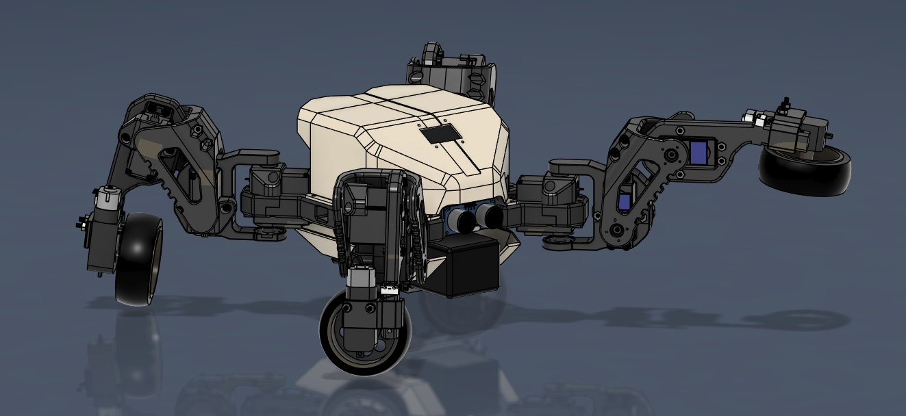

# KIBO Robot Project

## Overview

KIBO is an advanced robotics platform designed for modularity and versatility. The project includes hardware designs, electronics, and firmware to control a multi-legged wheeled robotic system. The primary goal is to implement inverse kinematics (IK) walking modes and wheeled modes and gait optimization using Model Predictive Path Integral (MPPI) control through micro-ROS (uROS) in ESP32 and ROS2 nodes with C++.

## Table of Contents

1. [Getting Started](#getting-started)
2. [Features](#features)
3. [Hardware Overview](#hardware-overview)
   - [CAD Files](#cad-files)
   - [Electronics](#electronics)
4. [Software Overview](#software-overview)
   - [ESP32 Firmware](#esp32-firmware)
   - [ROS2 Nodes](#ros2-nodes)
   - [Gait Optimization with MPPI](#gait-optimization-with-mppi)
5. [Installation and Setup](#installation-and-setup)
6. [Usage](#usage)
7. [Contributing](#contributing)
8. [License](#license)
9. [Acknowledgments](#acknowledgments)

## Getting Started

This project is intended for researchers, hobbyists, and developers interested in robotics. To get started with KIBO:

1. Clone this repository.
2. Set up the hardware following the instructions in the [Hardware Overview](#hardware-overview) section.
3. Flash the ESP32 with the firmware provided in the [ESP32 Firmware](#esp32-firmware) section.
4. Configure and run the ROS2 nodes as described in the [ROS2 Nodes](#ros2-nodes) section.

## Features

- **Inverse Kinematics (IK) Walking Modes**: Implement various walking gaits using IK.
- **Gait Optimization**: Optimize the robot's gait using Model Predictive Path Integral (MPPI) control.
- **Micro-ROS (uROS) Integration**: Utilize uROS for real-time communication between ESP32 and ROS2 nodes.
- **ESP32-based Control**: Leverage the ESP32 microcontroller for low-level control and sensor integration.

## Hardware Overview

### CAD Files

The `CAD` directory contains the STL files required to 3D print the robot's structural components. These include parts like the body frame, limbs, and armor:

- **Body Frame**: `Kibo frame.stl`
- **Coxa Components**: `Coxa Left.stl`, `Coxa Right.stl`
- **Tibia Components**: `Tibia.stl`, `Tibia Slider.stl`
- **Armor and Miscellaneous**: `Front Armor.stl`, `Back Armor.stl`, etc.

These components can be printed using any standard 3D printer. Ensure that you use durable materials like PLA+ or PETG for better structural integrity.

### Electronics

The `Electronics` directory contains the KiCad files for the KIBO V1 PCB, including:

- **Schematic**: `KIBO V1.kicad_sch`
- **PCB Layout**: `KIBO V1.kicad_pcb`
- **Manufacturing Files**: `KIBO_PCBFab.zip`

You can manufacture the PCB using the provided Gerber files or modify the design using KiCad.

#### Symbols and Footprints

This subdirectory includes additional component libraries for symbols and footprints used in the PCB design:

- ESP32-CAM
- GY-521 (IMU Sensor)
- HC-SR04 (Ultrasonic Sensor)

## Software Overview

### ESP32 Firmware

The ESP32 firmware is still to be developed, but test files can be located in the `Firmware/esp32_tests` directory for the ESP32 and the `Firmware/esp32_cam_tests` directory for the ESP32-CAM. This firmware is responsible for:

- Starting FreeRTOS and seting up the tasks and priorities.
- Managing sensors and actuators.
- Communicating with ROS2 nodes via micro-ROS (uROS).

#### Key Files:

- `platformio.ini`: Configuration file for PlatformIO.
- `src/main.cpp`: Main entry point for the ESP32 application.
- `include/camera_pins.h`: Header files, e.g., defining the camera's GPIO pins.

### ROS2 Nodes

The ROS2 nodes are designed to handle higher-level control and coordination. These nodes communicate with the ESP32 using uROS and handle tasks such as:

- High-level motion planning.
- Real-time data processing from the robot's sensors.
- Gait optimization using MPPI.

#### Planned Features:

The following planned features will be added to the `Simulation` directory.

- **Inverse Kinematics (IK) Implementation**: Calculate joint angles for desired end-effector positions.
- **Gait Optimization with MPPI**: Optimize walking gaits to enhance stability and energy efficiency.

### Gait Optimization with MPPI

MPPI (Model Predictive Path Integral) control is a powerful method for optimizing the robot's gait. It will be used to predict and adjust the robot's movements in real-time, ensuring smooth and stable walking patterns.

## Installation and Setup

### Prerequisites

- **PlatformIO**: Required for building and flashing the ESP32 firmware.
- **ROS2 Humble**: Recommended version of ROS2 for running the ROS2 nodes.
- **uROS Agent**: Necessary for communication between ESP32 and ROS2.

### Instructions

1. **ESP32 Firmware**:
   - Navigate to the `Firmware/esp32_tests` directory.
   - Install the necessary PlatformIO dependencies.
   - Build and upload the firmware to your ESP32 module.

2. **ROS2 Nodes**:
   - Set up a ROS2 workspace and clone this repository into the `src` directory.
   - Build the workspace using `colcon build`.
   - Launch the nodes using the provided launch files.

## Usage

1. Power on the KIBO robot.
2. Launch the ROS2 nodes on your PC.
3. The ESP32 will automatically start communicating with the ROS2 nodes.
4. Use the provided ROS2 interfaces to command the robot and monitor its state.

## Contributing

We welcome contributions to the KIBO project! If you have suggestions, bug reports, or want to contribute new features, please open an issue or submit a pull request.

### Guidelines

- Follow the existing coding style.
- Document your code thoroughly.
- Test your contributions before submitting.

## License

This project is licensed under the MIT License - see the [LICENSE](LICENSE) file for details.

## Acknowledgments

We would like to thank the open-source community for their valuable tools and libraries that made this project possible.
